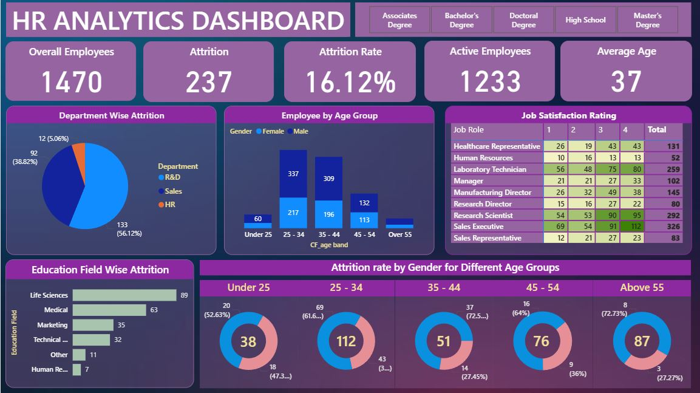

# Human Resource Analysis

## Table of Contents

- [Project Overview](#project-overview)
- [Data Sources](#data-sources)
- [Data Analysis](#data-analysis)
- [Findings](#findings)
- [Recommendations](#recommendations)

### Project Overview

This data analysis project explores employee turnover trends using SQL and Power BI. By analyzing HR data across gender, department, and job role, the goal is to uncover patterns in workforce movement and provide insights to help improve employee retention and organizational planning.



### Data Sources

HR Data: The dataset used in this project is the "hrdata.csv" file, which includes employee details such as age, gender, education, education field, department, job role, and attrition status. This data was used to analyze patterns in employee attrition and uncover insights across various demographic and organizational factors.

### Tools
- Excel - Data Cleaning

- pgAdmin 4 - Data Analysis

- PowerBI

### Data Cleaning/Preparation

I used Excel to remove duplicates and fix inconsistent formatting throughout the dataset. In Power BI, I transformed the data by adding new calculated columns to get more specific insights. I also had to convert the first row into headers, since Power BI initially reversed that. During this process, I learned how to change data types, which I now see as a powerful feature I’ll definitely use in future projects.

### Exploratory Data Analysis

EDA involved exploring the HR data to answer key questions, such as:

KPI's Requirement
- Employee Count
- Attrition Count
- Attrition Rate
- Active Employyes
- Active Employees
- Average Age

### Data Analysis

This is some of my queries I used

```sql
SELECT COUNT(attrition) 
FROM hrdata
WHERE attrition = 'Yes' 
  AND department = 'R&D' 
  AND education_field = 'Medical';
```

```sql
SELECT SUM(employee_count) - (
    SELECT COUNT(attrition) 
    FROM hrdata 
    WHERE attrition = 'Yes'
)
FROM hrdata;
```

```sql
SELECT gender, COUNT(attrition) 
FROM hrdata
WHERE attrition = 'Yes' 
  AND education = 'High School'
GROUP BY gender
ORDER BY COUNT(attrition) DESC;
```

```sql
SELECT 
    age_band,
    gender,
    COUNT(attrition) AS attrition, 
    ROUND(
        (CAST(COUNT(attrition) AS numeric) / 
         (SELECT COUNT(attrition) FROM hrdata WHERE attrition = 'Yes')) * 100, 
        2
    ) AS pct
FROM hrdata
WHERE attrition = 'Yes'
GROUP BY age_band, gender
ORDER BY age_band, gender DESC;
```

### Findings

1. The overall attrition rate is approximately 16.12% with 237 employees having left out of 1,470 total.
2. The R&D department has the highest attrition count 133, followed by Sales 92, while HR had the lowest 12.
3. Younger employees, especially those between the ages of 25 - 34, have the highest attrition rates across other ages and over 60% of them being female.
4. Attrition is noticeably higher among employees with Life Sciences and Medical education backgrounds.
5. High school–educated employees show higher turnover compared to those with higher education levels, having a attrition rate of 16.52%.
6. Sales Executives and Research Scientists represent the job roles with the highest headcounts and satisfaction variability, making them key groups to monitor for retention.
7. Gender-based analysis shows that male employees in certain age bands are more likely to leave, indicating potential retention issues tied to both age and gender.
8. The average age of employees is 37, and most attrition happens among those under the age of 45.

### Recommendations
Based on the analysis, I recommend the following actions:
- Investigate why the R&D department has the highest attrition and develop department-specific retention strategies.
- Focus on retention efforts for employees between the ages of 25–34, with a particular attention to male employees, who show the highest turnover in this group.
- Review career development and engagement programs for employees with Life Sciences and Medical education backgrounds to reduce attrition in those segments.
- Conduct satisfaction and exit surveys for Sales Executives and Research Scientists, as they represent a large portion of the workforce and may impact long term productivity.
- Consider mentorship or upskilling initiatives targeted at younger employees, especially those with only a high school education to support their growth and reduce early exits.

### References
1. Data Tutorials
   - [Tutorial](https://www.youtube.com/watch?v=jF2uIluPojw&list=PLO9LeSU_vHCWpfLDRTT5nBz9Z0libOs5k&index=6)
   - [Files](https://drive.google.com/drive/folders/1CWOfztUgvoN9caUbER7VAkka6z8zB34D)


